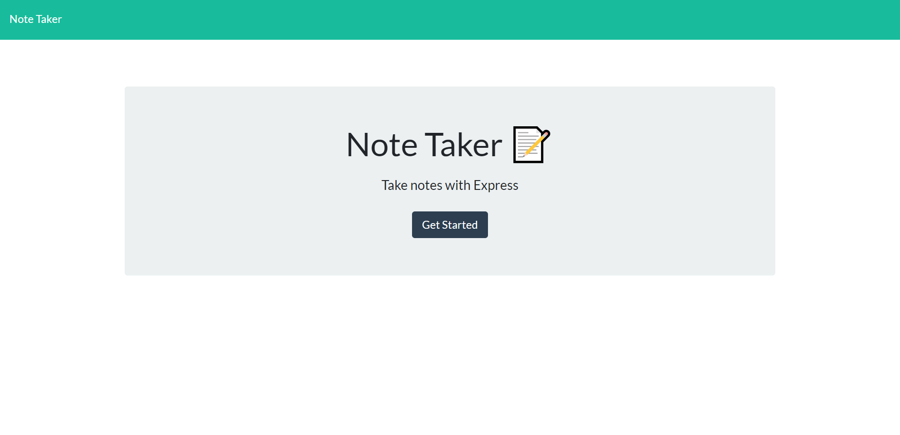
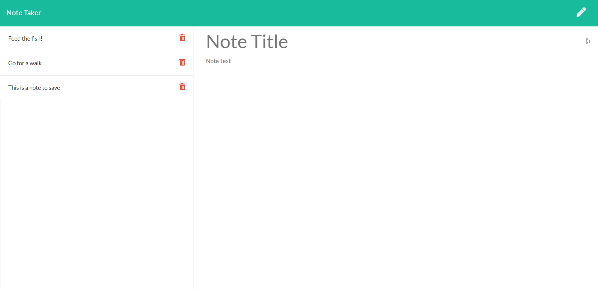

# Keepr

## Description
A modern note keeper for today's executive built using Express.js allowing users to create, view, and delete written notes.

## Table of contents
  - [Description](#description)
  - [Table of contents](#table-of-contents)
  - [Installation](#installation)
  - [Screenshots](#screenshots)
  - [Heroku Demo](#heroku-demo)
  - [Questions](#questions)

## Installation
 Both `express.js` and `uniqid` node packages are required for this application. From within the terminal type `npm install` to load the dependencies, then start the server by typing `node server.js` in a terminal within the top folder of this application. Open your prefered web broswer and navigate to `localhost:3000` to access the user interface.

## Screenshots

## Heroku Demo

[Click here to view the project live hosted on Heroku](https://keepr-note-taker.herokuapp.com/)

## Questions
Please direct questions to:
- E-mail: wing_andrew@hotmail.com
- Github:<https://github.com/wingeh>

